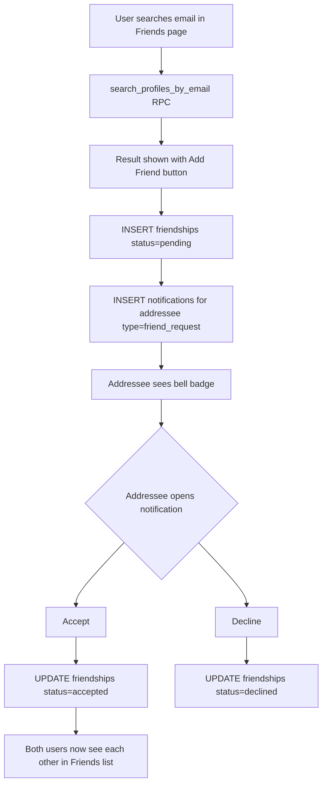
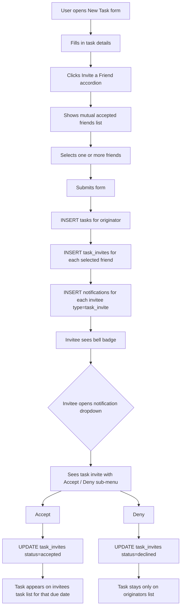

# Friend & Notification System — Architecture Plan

## Overview

This plan covers three interconnected features built on top of the existing AllMe stack (React + Vite + Supabase + Drizzle + TanStack Query + Zustand):

1. **Friend System** — search by email, send/accept/deny requests, remove friends, dedicated Friends page
2. **Notification System** — bell icon in TopNav, real-time dropdown, friend request & task invite notifications
3. **Task Invite System** — invite mutual friends when creating a task; accepted invites surface the task on the invitee's task list

---

## Data Model

### New Tables

```
friendships
───────────────────────────────────────────────────────
id            uuid PK
requester_id  uuid FK → profiles.id
addressee_id  uuid FK → profiles.id
status        text  CHECK IN ('pending','accepted','declined')
created_at    timestamptz
updated_at    timestamptz
UNIQUE (requester_id, addressee_id)

notifications
───────────────────────────────────────────────────────
id            uuid PK
user_id       uuid FK → profiles.id   ← recipient
actor_id      uuid FK → profiles.id   ← who triggered it
type          text  CHECK IN ('friend_request','task_invite')
reference_id  uuid  ← friendship.id OR task_invite.id
read          boolean DEFAULT false
created_at    timestamptz

task_invites
───────────────────────────────────────────────────────
id            uuid PK
task_id       uuid FK → tasks.id ON DELETE CASCADE
inviter_id    uuid FK → profiles.id
invitee_id    uuid FK → profiles.id
status        text  CHECK IN ('pending','accepted','declined')
created_at    timestamptz
updated_at    timestamptz
UNIQUE (task_id, invitee_id)
```

### RLS Policies

| Table | Policy |
|---|---|
| `friendships` | SELECT: requester_id = auth.uid() OR addressee_id = auth.uid() |
| `friendships` | INSERT: requester_id = auth.uid() |
| `friendships` | UPDATE: addressee_id = auth.uid() (accept/decline) OR requester_id = auth.uid() (cancel) |
| `notifications` | SELECT/UPDATE: user_id = auth.uid() |
| `notifications` | INSERT: actor_id = auth.uid() (or via DB trigger) |
| `task_invites` | SELECT: inviter_id = auth.uid() OR invitee_id = auth.uid() |
| `task_invites` | INSERT: inviter_id = auth.uid() |
| `task_invites` | UPDATE: invitee_id = auth.uid() |
| `profiles` | SELECT: auth.uid() = id OR id IN (friends of auth.uid()) OR for email search: public read on (id, username, avatar_url, email via auth.users join) |

### Profile Email Search

Supabase `auth.users` is not directly queryable from the client. The cleanest approach is a **Postgres function** (SECURITY DEFINER) that accepts an email string and returns matching profile rows joined with `auth.users.email`. This keeps email data server-side and avoids exposing the full auth table.

```sql
CREATE OR REPLACE FUNCTION search_profiles_by_email(search_email text)
RETURNS TABLE (id uuid, username text, avatar_url text, email text)
LANGUAGE sql SECURITY DEFINER AS $$
  SELECT p.id, p.username, p.avatar_url, u.email
  FROM profiles p
  JOIN auth.users u ON u.id = p.id
  WHERE lower(u.email) = lower(search_email)
    AND u.id != auth.uid()
  LIMIT 10;
$$;
```

---

## System Flow Diagrams

### Friend Request Flow



### Task Invite Flow



---

## File-by-File Implementation Plan

### Phase 1 — Database Migration

**New file:** [`src/db/migrations/0003_friends_notifications.sql`](src/db/migrations/0003_friends_notifications.sql)

- Create `friendships` table + RLS
- Create `notifications` table + RLS
- Create `task_invites` table + RLS
- Create `search_profiles_by_email` RPC function
- Create DB triggers to auto-insert notifications on friendship/task_invite INSERT
- Add indexes: `idx_friendships_requester`, `idx_friendships_addressee`, `idx_notifications_user_unread`, `idx_task_invites_invitee`

### Phase 2 — Drizzle Schema

**Modified file:** [`src/db/schema.ts`](src/db/schema.ts)

Add three new `pgTable` definitions:
- `friendships` — with `pgEnum` for status
- `notifications` — with `pgEnum` for type
- `task_invites` — with `pgEnum` for status
- Export inferred types: `FriendshipRow`, `NotificationRow`, `TaskInviteRow`

### Phase 3 — TypeScript Types

**Modified file:** [`src/types/index.ts`](src/types/index.ts)

New types:
```ts
FriendshipStatus = 'pending' | 'accepted' | 'declined'
NotificationType = 'friend_request' | 'task_invite'

interface Friendship { id, requesterId, addresseeId, status, createdAt, updatedAt }
interface Notification { id, userId, actorId, type, referenceId, read, createdAt }
interface TaskInvite { id, taskId, inviterId, inviteeId, status, createdAt, updatedAt }

// Enriched types for UI
interface FriendProfile { id, username, avatarUrl, email }
interface NotificationWithActor extends Notification { actor: FriendProfile, task?: Task }
```

### Phase 4 — useFriends Hook

**New file:** [`src/hooks/useFriends.ts`](src/hooks/useFriends.ts)

Exports:
- `useFriends()` — query accepted friends list (both directions)
- `usePendingRequests()` — query incoming pending requests
- `useSearchUsers(email)` — debounced RPC call to `search_profiles_by_email`
- `useSendFriendRequest()` — mutation: INSERT friendship + notification
- `useRespondToFriendRequest()` — mutation: UPDATE friendship status
- `useRemoveFriend()` — mutation: DELETE friendship row

### Phase 5 — useNotifications Hook

**New file:** [`src/hooks/useNotifications.ts`](src/hooks/useNotifications.ts)

Exports:
- `useNotifications()` — query all notifications for current user, enriched with actor profile
- `useUnreadCount()` — derived count from above
- `useMarkNotificationRead()` — mutation: UPDATE read=true
- `useMarkAllRead()` — mutation: UPDATE all read=true
- Supabase Realtime subscription on `notifications` table filtered by `user_id=eq.{userId}` to invalidate query on INSERT

### Phase 6 — useTaskInvites Hook

**New file:** [`src/hooks/useTaskInvites.ts`](src/hooks/useTaskInvites.ts)

Exports:
- `useSendTaskInvites()` — mutation: INSERT task_invites + notifications for each invitee
- `useRespondToTaskInvite()` — mutation: UPDATE task_invite status
- `useSharedTasks()` — query tasks where current user has an accepted task_invite (joins tasks table)

### Phase 7 — UIStore Extension

**Modified file:** [`src/store/uiStore.ts`](src/store/uiStore.ts)

Add:
```ts
notificationPanelOpen: boolean
setNotificationPanelOpen: (open: boolean) => void
toggleNotificationPanel: () => void
```

### Phase 8 — NotificationBell Component

**New file:** [`src/components/notifications/NotificationBell.tsx`](src/components/notifications/NotificationBell.tsx)

- Bell SVG icon button with red unread-count badge (hidden when 0)
- Click toggles `notificationPanelOpen` in uiStore
- Dropdown panel (absolute positioned, z-50) renders list of `NotificationItem` sub-components
- Each `NotificationItem` shows: actor avatar initials, message text, relative timestamp
- For `friend_request` type: inline Accept / Decline buttons
- For `task_invite` type: inline Accept / Deny buttons with task title shown
- "Mark all read" button at top of panel
- Click-outside overlay to close

### Phase 9 — TopNav Update

**Modified file:** [`src/components/layout/TopNav.tsx`](src/components/layout/TopNav.tsx)

Insert `<NotificationBell />` between the theme toggle button and the avatar menu button.

### Phase 10 — FriendCard Component

**New file:** [`src/components/friends/FriendCard.tsx`](src/components/friends/FriendCard.tsx)

Displays:
- Avatar circle (initials fallback if no avatarUrl)
- Display name (username or email prefix)
- Email address
- "Remove Friend" button (with confirmation)

### Phase 11 — FriendSearch Component

**New file:** [`src/components/friends/FriendSearch.tsx`](src/components/friends/FriendSearch.tsx)

- Email input field with debounce (300ms)
- Calls `useSearchUsers` hook
- Shows result card with profile info + "Send Friend Request" button
- Handles states: idle, searching, not found, already friends, request pending, self

### Phase 12 — FriendsPage

**New file:** [`src/pages/FriendsPage.tsx`](src/pages/FriendsPage.tsx)

Sections:
1. **Add a Friend** — `<FriendSearch />` at top
2. **Pending Requests** — incoming requests with Accept/Decline (only shown if count > 0)
3. **My Friends** — grid/list of `<FriendCard />` components
4. Empty states for each section

### Phase 13 — Router Update

**Modified file:** [`src/router/index.tsx`](src/router/index.tsx)

Add `{ path: '/friends', element: <FriendsPage /> }` inside the `ProtectedLayout` children array.

### Phase 14 — Sidebar Update

**Modified file:** [`src/components/layout/Sidebar.tsx`](src/components/layout/Sidebar.tsx)

Add Friends nav item with a people/users SVG icon between Calendar and Settings.

### Phase 15 — InviteFriendPicker Component

**New file:** [`src/components/friends/InviteFriendPicker.tsx`](src/components/friends/InviteFriendPicker.tsx)

- Collapsible accordion section (open/close toggle)
- Renders list of accepted mutual friends (from `useFriends`)
- Each friend row has a checkbox
- Selected friends stored in local state, passed up via `onChange` callback prop
- Shows "No friends yet" empty state

### Phase 16 — TaskForm Update

**Modified file:** [`src/components/tasks/TaskForm.tsx`](src/components/tasks/TaskForm.tsx)

- Add `invitedFriendIds: string[]` to local state
- Render `<InviteFriendPicker onChange={setInvitedFriendIds} />` below the Status select (only when creating, not editing)
- In `onSubmit`: after `createTask()` resolves, call `sendTaskInvites({ taskId, inviteeIds: invitedFriendIds })` if any friends selected
- Task is always created regardless of invite outcome

### Phase 17 — useTasks Update

**Modified file:** [`src/hooks/useTasks.ts`](src/hooks/useTasks.ts)

- `useTasks()` now also fetches tasks from `task_invites` where `invitee_id = user.id AND status = 'accepted'`, joins with `tasks` table
- Merges and deduplicates results
- Adds `isShared: boolean` and `inviterName?: string` fields to the `Task` type for UI differentiation

### Phase 18 — Profiles RLS Update

**Part of migration 0003** — add a policy allowing authenticated users to call the `search_profiles_by_email` function (handled via SECURITY DEFINER, no additional RLS needed on profiles table itself for the function). Also add a policy so friends can read each other's profiles:

```sql
CREATE POLICY "Friends can view each other profiles"
  ON profiles FOR SELECT
  USING (
    auth.uid() = id
    OR id IN (
      SELECT CASE WHEN requester_id = auth.uid() THEN addressee_id ELSE requester_id END
      FROM friendships
      WHERE (requester_id = auth.uid() OR addressee_id = auth.uid())
        AND status = 'accepted'
    )
  );
```

---

## Component Tree (New)

```
AppShell
├── Sidebar
│   └── + Friends nav item
├── TopNav
│   ├── ThemeToggle
│   ├── NotificationBell          ← NEW
│   │   └── NotificationDropdown
│   │       └── NotificationItem (×n)
│   └── AvatarMenu
└── <Outlet>
    ├── FriendsPage               ← NEW
    │   ├── FriendSearch
    │   └── FriendCard (×n)
    └── TasksPage / CalendarPage
        └── TaskForm (updated)
            └── InviteFriendPicker ← NEW
```

---

## Key Design Decisions

| Decision | Rationale |
|---|---|
| Notifications via DB triggers | Keeps notification creation atomic with the action; no risk of client-side failure leaving orphan records |
| SECURITY DEFINER function for email search | Avoids exposing auth.users to client; email lookup stays server-side |
| Shared tasks via task_invites join | Avoids duplicating task rows; single source of truth for task data |
| Realtime subscription on notifications | Instant bell badge update without polling |
| Mutual friends only for task invites | Prevents spam; both users must have accepted the friendship first |
| Task always created on originator list | Invite is additive; originator's workflow is never blocked by invitee response |

---

## Migration Execution Order

Run in Supabase SQL Editor:
1. `0003_friends_notifications.sql` — all new tables, RLS, triggers, functions
2. No Drizzle push needed for Supabase-managed DB; schema.ts is kept in sync for type inference only

