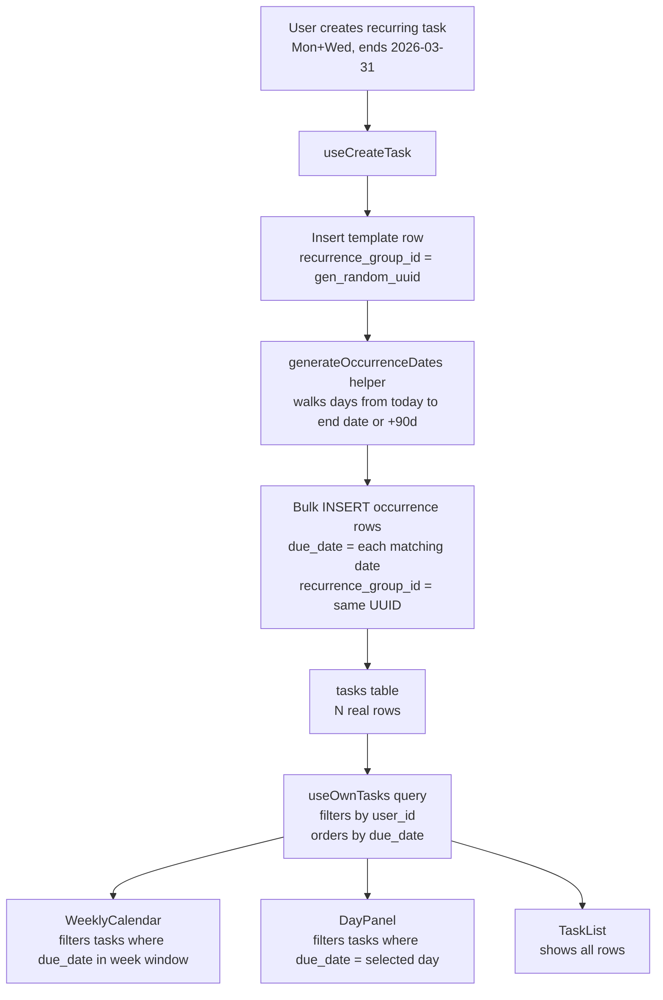

# Recurring Task Refactor: One Row Per Occurrence

## Overview

Replace the current "one template row + client-side virtual expansion" model with **one real database row per occurrence**, linked by a `recurrence_group_id` UUID. This eliminates the `task_occurrence_completions` side-table, the `expandRecurringTask` virtual-instance generator, and all the fragile virtual-ID plumbing.

---

## Architecture Diagram



---

## Implementation Order

Changes are ordered to minimise breakage: database first, types second, data layer third, UI last.

1. **SQL migration** — schema change + drop old table
2. **`schema.ts`** — add column to Drizzle model
3. **`types/index.ts`** — update `Task` interface
4. **`lib/recurrence.ts`** — remove virtual expansion, keep date helpers
5. **`hooks/useOccurrenceCompletions.ts`** — DELETE file
6. **`hooks/useTasks.ts`** — rewrite create, add bulk mutations
7. **`components/tasks/RecurringCompleteDialog.tsx`** — generalise for delete too
8. **`components/tasks/TaskCard.tsx`** — simplify completion + delete
9. **`components/tasks/TaskForm.tsx`** — remove due-date clearing side-effect
10. **`components/calendar/TaskDetailPopup.tsx`** — remove virtual-ID logic, add delete-all
11. **`components/calendar/DayPanel.tsx`** — remove `expandRecurringTask`
12. **`components/calendar/WeeklyCalendar.tsx`** — remove `expandRecurringTask`

---

## Step 1 — SQL Migration (`src/db/migrations/0011_recurrence_group_rows.sql`)

```sql
-- ─────────────────────────────────────────────────────────────────────────────
-- AllMe — Recurrence Group Rows
-- Each occurrence of a recurring task gets its own real row, linked by
-- recurrence_group_id. The task_occurrence_completions table is dropped.
-- Run this in your Supabase SQL Editor.
-- ─────────────────────────────────────────────────────────────────────────────

-- 1. Add recurrence_group_id to tasks
ALTER TABLE tasks
  ADD COLUMN IF NOT EXISTS recurrence_group_id uuid;

COMMENT ON COLUMN tasks.recurrence_group_id IS
  'Groups all occurrence rows of the same recurring series. '
  'NULL for non-recurring tasks. Set to gen_random_uuid() on the first '
  'occurrence and copied to all siblings.';

-- Index for fast "fetch all occurrences in a series" queries
CREATE INDEX IF NOT EXISTS idx_tasks_recurrence_group
  ON tasks (recurrence_group_id)
  WHERE recurrence_group_id IS NOT NULL;

-- 2. Drop the now-redundant occurrence completions table
--    (policies, indexes, and the RPC are dropped automatically via CASCADE)
DROP TABLE IF EXISTS task_occurrence_completions CASCADE;

DROP FUNCTION IF EXISTS complete_task_occurrence(uuid, uuid, date, timestamptz);
```

**Why no backfill?** Existing recurring template rows have `recurrence_group_id = NULL`. They will continue to appear in the task list as plain tasks until the user deletes and recreates them. This is acceptable for a dev/early-stage app. If a backfill is needed later, a separate one-off script can generate occurrence rows for existing templates.

---

## Step 2 — `src/db/schema.ts`

Add one column to the `tasks` table definition:

```ts
recurrenceGroupId: uuid('recurrence_group_id'),
```

Place it after `recurrenceEndDate`. No `.notNull()` — it is `NULL` for non-recurring tasks.

---

## Step 3 — `src/types/index.ts`

### Changes to `Task` interface

```ts
export interface Task {
  id: string
  userId: string
  title: string
  description: string | null
  dueDate: string | null
  startTime: string | null
  endTime: string | null
  isRecurring: boolean
  recurrenceDays: RecurrenceDay[]
  recurrenceEndDate: string | null
  recurrenceGroupId: string | null   // ← ADD
  priority: TaskPriority
  status: TaskStatus
  completedAt: string | null
  createdAt: string
  updatedAt: string
  isShared?: boolean
  inviterName?: string | null
  inviterEmail?: string | null
  taskInviteId?: string | null
  // isVirtual is REMOVED — no more virtual instances
}
```

Remove `isVirtual?: boolean` entirely.

---

## Step 4 — `src/lib/recurrence.ts`

### Remove

- `expandRecurringTask()` — no longer needed (real rows exist)
- `getRealTaskId()` — no more virtual IDs
- `DAY_INDEX_TO_KEY` constant (used only by `expandRecurringTask`)
- The `parseDateStr` / `toDateStr` private helpers can be **kept** (they are useful for the new occurrence generator in `useTasks`)

### Keep / rename as exported helpers

```ts
/** Parse a YYYY-MM-DD string into a local Date (midnight) */
export function parseDateStr(dateStr: string): Date { ... }

/** Format a local Date to YYYY-MM-DD */
export function toDateStr(date: Date): string { ... }
```

Export these so `useTasks.ts` can import them for occurrence generation.

### Keep unchanged

- `formatTime()`
- `formatTimeRange()`
- `timeToMinutes()`
- `formatRecurrenceDays()`

### Add new exported helper

```ts
const DAY_INDEX_TO_KEY: RecurrenceDay[] =
  ['sun', 'mon', 'tue', 'wed', 'thu', 'fri', 'sat']

/**
 * Generate all occurrence dates for a recurring task within a window.
 * Returns YYYY-MM-DD strings for each day that matches recurrenceDays.
 *
 * @param startDate   First date to consider (YYYY-MM-DD), inclusive
 * @param endDate     Last date to consider (YYYY-MM-DD), inclusive
 * @param recurrenceDays  Days of week to match
 */
export function generateOccurrenceDates(
  startDate: string,
  endDate: string,
  recurrenceDays: RecurrenceDay[]
): string[] {
  const daySet = new Set(recurrenceDays)
  const dates: string[] = []
  const cursor = parseDateStr(startDate)
  const end = parseDateStr(endDate)
  while (cursor <= end) {
    if (daySet.has(DAY_INDEX_TO_KEY[cursor.getDay()])) {
      dates.push(toDateStr(cursor))
    }
    cursor.setDate(cursor.getDate() + 1)
  }
  return dates
}
```

---

## Step 5 — Delete `src/hooks/useOccurrenceCompletions.ts`

Delete the file entirely. All imports of this module across the codebase must be removed:

| File | Import to remove |
|------|-----------------|
| `src/components/tasks/TaskCard.tsx` | `useCompleteOccurrence`, `useUncompleteOccurrence`, `useOccurrenceCompletionSet` |
| `src/components/calendar/TaskDetailPopup.tsx` | `useCompleteOccurrence`, `useUncompleteOccurrence`, `useOccurrenceCompletionSet` |
| `src/components/calendar/DayPanel.tsx` | `useOccurrenceCompletionSet`, `useCompleteOccurrence`, `useUncompleteOccurrence` |
| `src/components/calendar/WeeklyCalendar.tsx` | `useOccurrenceCompletionSet` |

---

## Step 6 — `src/hooks/useTasks.ts`

### `mapRow` — add `recurrenceGroupId`

```ts
function mapRow(row: Record<string, unknown>): Task {
  return {
    ...existing fields...,
    recurrenceGroupId: (row.recurrence_group_id as string) ?? null,  // ← ADD
    isShared: false,
  }
}
```

Also add `recurrence_group_id` to the explicit column list in `useSharedTasksQuery`.

### `useCreateTask` — generate occurrence rows

The mutation becomes a two-step operation:

```
1. INSERT template row  →  get back { id, recurrence_group_id }
2. If isRecurring:
     a. Compute recurrence_group_id = template.id  (reuse template's PK as group ID)
     b. UPDATE template row: SET recurrence_group_id = template.id
     c. Generate occurrence dates via generateOccurrenceDates(today, endDate, days)
     d. Bulk INSERT one row per date with:
          - recurrence_group_id = template.id
          - due_date = occurrence date
          - is_recurring = true
          - recurrence_days = same as template
          - recurrence_end_date = same as template
          - status = 'todo'
          - all other fields copied from template
          - id = gen_random_uuid() (auto by DB)
```

**Window calculation:**
- Start: today's date (local, `new Date().toISOString().slice(0, 10)`)
- End: `recurrenceEndDate` if set, otherwise today + 90 days

**Bulk insert:** Use a single `supabase.from('tasks').insert([...occurrencePayloads])` call. Supabase/PostgREST accepts an array for bulk insert.

**Template row visibility:** The template row itself has `due_date = null` (the user didn't set one for recurring tasks). The task list and calendar filter by `due_date`, so the template row will only appear in the "no due date" section of the task list — which is acceptable. Alternatively, the template can be hidden by filtering `WHERE recurrence_group_id IS NULL OR due_date IS NOT NULL` in `useOwnTasks`. See edge cases below.

### `useCompleteAllRecurringTasks` — rewrite to use `recurrence_group_id`

```ts
export function useCompleteAllRecurringTasks() {
  return useMutation({
    mutationFn: async ({ recurrenceGroupId }: { recurrenceGroupId: string }) => {
      const now = new Date().toISOString()
      const { error } = await supabase
        .from('tasks')
        .update({ status: 'done', completed_at: now, updated_at: now })
        .eq('user_id', user.id)
        .eq('recurrence_group_id', recurrenceGroupId)
      if (error) throw error
    },
    onSuccess: () => queryClient.invalidateQueries({ queryKey: [TASKS_QUERY_KEY, user?.id] }),
  })
}
```

### Add `useDeleteAllRecurringOccurrences`

```ts
export function useDeleteAllRecurringOccurrences() {
  return useMutation({
    mutationFn: async ({ recurrenceGroupId }: { recurrenceGroupId: string }) => {
      const { error } = await supabase
        .from('tasks')
        .delete()
        .eq('user_id', user.id)
        .eq('recurrence_group_id', recurrenceGroupId)
      if (error) throw error
    },
    onSuccess: () => queryClient.invalidateQueries({ queryKey: [TASKS_QUERY_KEY, user?.id] }),
  })
}
```

### `useOwnTasks` — filter out template rows

To avoid showing the template row (which has `due_date = null` and `recurrence_group_id = <its own id>`) in the task list alongside its occurrence children, add a filter:

```ts
.or('recurrence_group_id.is.null,due_date.not.is.null')
```

This means: show the row if it has no recurrence group (plain task) OR if it has a due_date (it's an occurrence row, not the template). The template row has `recurrence_group_id IS NOT NULL` AND `due_date IS NULL`, so it is excluded.

---

## Step 7 — `src/components/tasks/RecurringCompleteDialog.tsx`

Generalise the dialog to handle both **complete** and **delete** actions. Rename props to be action-agnostic:

```ts
interface RecurringActionDialogProps {
  open: boolean
  taskTitle: string
  mode: 'complete' | 'delete'   // ← NEW
  onActionOne: () => void        // was onCompleteOne
  onActionAll: () => void        // was onCompleteAll
  onClose: () => void
}
```

Dialog copy changes based on `mode`:

| `mode` | Title | Body | Button 1 | Button 2 |
|--------|-------|------|----------|----------|
| `complete` | "Complete recurring task" | "…complete just this occurrence, or mark all as complete?" | "Complete this occurrence only" | "Complete all occurrences" |
| `delete` | "Delete recurring task" | "…delete just this occurrence, or delete the entire series?" | "Delete this occurrence only" | "Delete entire series" |

> **Note:** Keep the existing export name `RecurringCompleteDialog` or rename to `RecurringActionDialog` — either works, but renaming requires updating all import sites. Keeping the name and adding the `mode` prop is less disruptive.

---

## Step 8 — `src/components/tasks/TaskCard.tsx`

### Remove entirely

- Import of `useCompleteOccurrence`, `useUncompleteOccurrence`, `useOccurrenceCompletionSet` from `useOccurrenceCompletions`
- `completeOccurrence`, `uncompleteOccurrence`, `completedDates` variables
- `realTaskId`, `occurrenceDate`, `occurrenceKey` virtual-ID logic
- `handleCompleteOne` / `handleCompleteAll` (old occurrence-based versions)

### Simplify `isDone`

```ts
const isDone = task.status === 'done'
```

### Simplify `handleToggle`

For recurring tasks, when marking complete, show the `RecurringCompleteDialog` (mode=`'complete'`). When reopening, just call `toggleStatus` directly.

```ts
const handleToggle = () => {
  if (!isDone && task.isRecurring) {
    setShowRecurringDialog(true)   // ask: this one or all?
    return
  }
  toggleStatus({ id: task.id, currentStatus: task.status, isShared: task.isShared }, ...)
}

const handleCompleteOne = () => {
  toggleStatus({ id: task.id, currentStatus: task.status, isShared: task.isShared }, ...)
}

const handleCompleteAll = () => {
  if (!task.recurrenceGroupId) return
  completeAll({ recurrenceGroupId: task.recurrenceGroupId }, ...)
}
```

### Add delete dialog for recurring tasks

When the delete button is clicked on a recurring task, show the dialog in `mode='delete'`:

```ts
const [showDeleteDialog, setShowDeleteDialog] = useState(false)

const handleDeleteClick = () => {
  if (task.isRecurring && task.recurrenceGroupId) {
    setShowDeleteDialog(true)
  } else {
    handleDeleteOne()
  }
}

const handleDeleteOne = () => {
  deleteTask(task.id, { onSuccess: () => toast.success('Task deleted') })
}

const handleDeleteAll = () => {
  deleteAllOccurrences({ recurrenceGroupId: task.recurrenceGroupId! }, ...)
}
```

Render two `RecurringCompleteDialog` instances (one for complete, one for delete) OR use a single dialog with a `mode` state variable.

---

## Step 9 — `src/components/tasks/TaskForm.tsx`

### Remove the `useEffect` that clears `dueDate` when recurring is toggled on

```ts
// DELETE this entire effect:
useEffect(() => {
  if (isRecurring) {
    setValue('dueDate', '', { shouldValidate: false })
  }
}, [isRecurring, setValue])
```

In the new model, recurring tasks **do not have a user-set due date** — each occurrence row gets its own `due_date` generated automatically. The due date field in the form should remain hidden when `isRecurring = true` (the existing `{!isRecurring && <Input label="Due Date" ... />}` conditional is correct and stays).

### No other form changes needed

The form still collects `isRecurring`, `recurrenceDays`, `recurrenceEndDate`. The `useCreateTask` mutation handles generating the occurrence rows from those values.

### Edit mode — what happens when editing a recurring task?

When `editingTaskId` is set and the task `isRecurring`, the form edits **that single occurrence row** only (title, description, time, priority, status). This is the simplest correct behaviour. A future enhancement could offer "edit all in series" by updating all rows with the same `recurrence_group_id`.

For now, the `useUpdateTask` mutation is unchanged — it updates the single row by `id`.

---

## Step 10 — `src/components/calendar/TaskDetailPopup.tsx`

### Remove

- Import of `useCompleteOccurrence`, `useUncompleteOccurrence`, `useOccurrenceCompletionSet`
- Import of `getRealTaskId` from `recurrence.ts`
- `realTaskId`, `occurrenceDate`, `completedDates`, `occurrenceKey` variables
- `completeOccurrence`, `uncompleteOccurrence` mutations
- `handleCompleteOne` / `handleCompleteAll` (old occurrence-based versions)

### Simplify task lookup

```ts
// taskDetailTaskId is now always a real UUID (no more "virtual:uuid:date" format)
const task = taskDetailTaskId
  ? tasks.find((t) => t.id === taskDetailTaskId)
  : null
```

### Simplify `isDone`

```ts
const isDone = task?.status === 'done'
```

### Rewrite `handleToggle`

```ts
const handleToggle = () => {
  if (!task) return
  if (!isDone && task.isRecurring) {
    setShowRecurringDialog(true)   // complete: this one or all?
    return
  }
  toggleStatus({ id: task.id, currentStatus: task.status, isShared: task.isShared }, ...)
}

const handleCompleteOne = () => {
  toggleStatus({ id: task.id, currentStatus: 'todo', isShared: task.isShared }, ...)
}

const handleCompleteAll = () => {
  if (!task?.recurrenceGroupId) return
  completeAll({ recurrenceGroupId: task.recurrenceGroupId }, ...)
}
```

### Add delete dialog for recurring tasks

```ts
const [showDeleteDialog, setShowDeleteDialog] = useState(false)

const handleDelete = () => {
  if (!task) return
  if (task.isRecurring && task.recurrenceGroupId) {
    setShowDeleteDialog(true)
    return
  }
  deleteTask(task.id, { onSuccess: () => { toast.success('Task deleted'); closeTaskDetail() } })
}

const handleDeleteOne = () => {
  deleteTask(task!.id, { onSuccess: () => { toast.success('Task deleted'); closeTaskDetail() } })
}

const handleDeleteAll = () => {
  deleteAllOccurrences(
    { recurrenceGroupId: task!.recurrenceGroupId! },
    { onSuccess: () => { toast.success('Series deleted'); closeTaskDetail() } }
  )
}
```

Render both dialogs (complete + delete) above the `AnimatePresence` block.

---

## Step 11 — `src/components/calendar/DayPanel.tsx`

### Remove

- Import of `expandRecurringTask`, `getRealTaskId` from `recurrence.ts`
- Import of `useOccurrenceCompletionSet`, `useCompleteOccurrence`, `useUncompleteOccurrence`
- `completedDates`, `completeOccurrence`, `uncompleteOccurrence` variables
- `completeAll` / `handleRecurringCompleteOne` / `handleRecurringCompleteAll` (old occurrence-based)
- The `recurringDialog` state (replace with simpler dialog state)

### Simplify `dayTasks` computation

```ts
const dayTasks = useMemo(() => {
  if (!calendarSelectedDay) return []
  // Real rows only — filter by due_date
  return tasks.filter((t) => t.dueDate === calendarSelectedDay)
}, [tasks, calendarSelectedDay])
```

### Simplify `handleToggle`

```ts
const handleToggle = (id: string, currentStatus: Task['status'], task?: Task) => {
  if (currentStatus !== 'done' && task?.isRecurring) {
    setRecurringDialog({ open: true, task: task })
    return
  }
  toggleStatus({ id, currentStatus }, ...)
}
```

### Add delete dialog

Same pattern as `TaskDetailPopup` — show `RecurringCompleteDialog` in `mode='delete'` when delete is clicked on a recurring task.

### `AllDayRow` — remove `getRealTaskId` calls

Since there are no more virtual IDs, `getRealTaskId(task.id)` → `task.id` everywhere in `DayPanel`.

### `TimelineBlock` — same simplification

`getRealTaskId(task.id)` → `task.id`.

---

## Step 12 — `src/components/calendar/WeeklyCalendar.tsx`

### Remove

- Import of `expandRecurringTask` from `recurrence.ts`
- Import of `useOccurrenceCompletionSet`
- `completedDates` variable

### Simplify `tasksByDate`

```ts
const tasksByDate = useMemo(() => {
  const map = new Map<string, Task[]>()
  for (const task of tasks) {
    if (!task.dueDate) continue
    const existing = map.get(task.dueDate) ?? []
    map.set(task.dueDate, [...existing, task])
  }
  return map
}, [tasks])
```

No window filtering needed — `useOwnTasks` already returns all tasks. The calendar just groups them by `due_date`. Tasks outside the visible week simply won't appear in the map for those dates.

---

## Edge Cases & Decisions

### 1. Template row visibility in task list

The template row has `due_date = NULL` and `recurrence_group_id = <its own id>`. The `useOwnTasks` query adds `.or('recurrence_group_id.is.null,due_date.not.is.null')` to exclude it. This means the template is invisible to the user — only occurrence rows appear.

### 2. Editing a recurring task

Editing opens the form pre-filled with **that occurrence's** data. Saving calls `useUpdateTask` which updates only that row. This is "edit this occurrence only" by default. A future "edit all in series" feature would call `UPDATE tasks SET ... WHERE recurrence_group_id = X AND user_id = Y`.

### 3. Occurrence window — what if `recurrenceEndDate` is far in the future?

Cap at 90 days from today to avoid generating thousands of rows. If the user sets `recurrenceEndDate` beyond 90 days, only 90 days of occurrences are pre-generated. A background job or a "generate more" button can extend the window later.

### 4. Past occurrences

Occurrences in the past are real rows with their own `status`. They appear in the task list as overdue if `status = 'todo'` and `due_date < today`. This is correct behaviour.

### 5. Deleting a single occurrence vs. the whole series

- **Delete one:** `DELETE FROM tasks WHERE id = X AND user_id = Y` (existing `useDeleteTask`)
- **Delete all:** `DELETE FROM tasks WHERE recurrence_group_id = X AND user_id = Y` (new `useDeleteAllRecurringOccurrences`)

The dialog is shown whenever the task has `isRecurring = true && recurrenceGroupId != null`.

### 6. `task_invites` referencing occurrence rows

`task_invites.task_id` references `tasks.id`. Invites can be sent to individual occurrence rows. This is fine — the invite is for a specific occurrence. If the user deletes all occurrences, the `ON DELETE CASCADE` on `task_invites.task_id` will clean up the invites automatically.

### 7. `pomodoro_sessions` referencing occurrence rows

Same as above — `pomodoro_sessions.task_id` has `ON DELETE SET NULL`, so deleting occurrences sets `task_id = NULL` on related sessions. No action needed.

### 8. Shared tasks (`useSharedTasksQuery`)

The shared tasks query joins `task_invites` → `tasks`. Occurrence rows are real tasks, so they appear correctly. Add `recurrence_group_id` to the explicit column list in the join select.

### 9. `useCompleteAllRecurringTasks` — old title-based matching

The old implementation matched by `title + is_recurring = true`. This was fragile (two different series with the same title would both be completed). The new implementation matches by `recurrence_group_id`, which is exact and safe.

### 10. `RecurringCompleteDialog` rename

To minimise diff, keep the component name `RecurringCompleteDialog` and add a `mode` prop. All existing call sites pass `mode="complete"` (or omit it with a default). New delete call sites pass `mode="delete"`.

---

## Files Summary

| File | Action | Key change |
|------|--------|-----------|
| `src/db/migrations/0011_recurrence_group_rows.sql` | **CREATE** | Add `recurrence_group_id` column, drop `task_occurrence_completions` |
| `src/db/schema.ts` | **EDIT** | Add `recurrenceGroupId: uuid('recurrence_group_id')` |
| `src/types/index.ts` | **EDIT** | Add `recurrenceGroupId`, remove `isVirtual` |
| `src/lib/recurrence.ts` | **EDIT** | Remove `expandRecurringTask`, `getRealTaskId`; export `generateOccurrenceDates`, `parseDateStr`, `toDateStr` |
| `src/hooks/useOccurrenceCompletions.ts` | **DELETE** | Entire file removed |
| `src/hooks/useTasks.ts` | **EDIT** | `mapRow` + `useCreateTask` (generate occurrences) + `useCompleteAllRecurringTasks` (group ID) + new `useDeleteAllRecurringOccurrences` + `useOwnTasks` filter |
| `src/components/tasks/RecurringCompleteDialog.tsx` | **EDIT** | Add `mode` prop for complete vs delete |
| `src/components/tasks/TaskCard.tsx` | **EDIT** | Remove occurrence hooks, simplify toggle, add delete dialog |
| `src/components/tasks/TaskForm.tsx` | **EDIT** | Remove `useEffect` that clears due date |
| `src/components/calendar/TaskDetailPopup.tsx` | **EDIT** | Remove virtual-ID logic, simplify `isDone`, add delete dialog |
| `src/components/calendar/DayPanel.tsx` | **EDIT** | Remove `expandRecurringTask`, filter by `due_date` directly |
| `src/components/calendar/WeeklyCalendar.tsx` | **EDIT** | Remove `expandRecurringTask`, group real rows by `due_date` |
